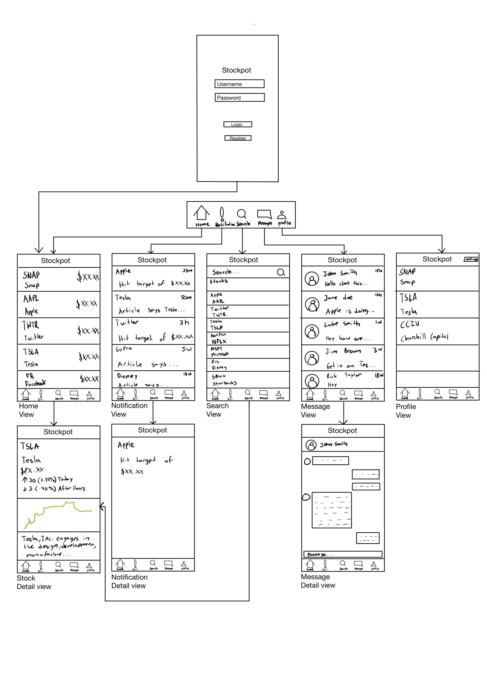
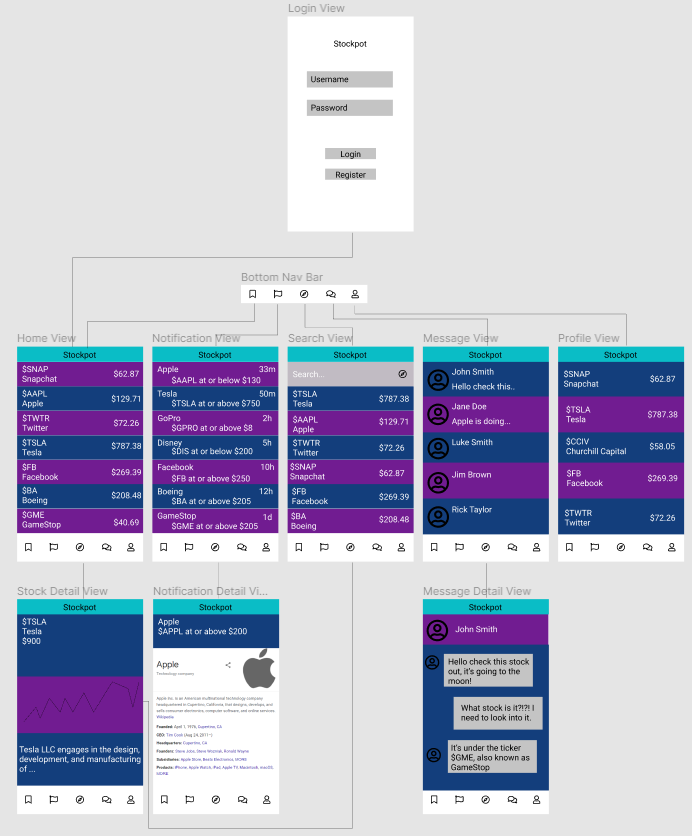
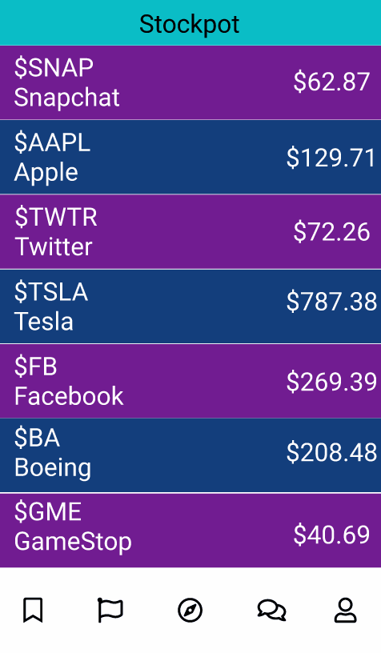

Original App Design Project - README
===

# Stockpile

## Table of Contents
1. [Overview](#Overview)
1. [Product Spec](#Product-Spec)
1. [Wireframes](#Wireframes)
2. [Schema](#Schema)

## Overview
### Description
Tracks stocks, and retrieves data from an API. Allows the user to recieve an alert when a specific stock hits a certain price.

### App Evaluation
- **Category:** Finance
- **Mobile:** The application is primarly developed for mobile, however it would be viable for future implementation on computer or web-based applications.
- **Story:** Analyzes user selected stocks and displays data about them, and notifies them when stocks hit a threshold. 
- **Market:** Any individual over 18 can use this application to augment their trading experience. 
- **Habit:** This app can be used as often as the user would like depending on how interested the user is in stock trading.
- **Scope:** The audience of this app is targeted towards those who are interested in trading equities or learning more about trading in general.

## Product Spec

### 1. User Stories (Required and Optional)

**Required Must-have Stories**

* Create an account, log in, log out
* Search for stock and have a list matching search query pop up
* Detail view for the individual stock
* Feed of related stocks 
* Allow user to create a watchlist for easy access to favorited stocks
* Allow user to create alerts for stocks

**Optional Nice-to-have Stories**

* News for relevant stocks (from Bloomberg API)
* Social media aspect
    * Messages

### 2. Screen Archetypes

* Login
* Register - User signs up or logs into their account
   * Upon Download/Reopening of the application, the user is prompted to log in to gain access to their profile information.
* Home/Trending Feed
   * User can view the current top trending stocks
* Settings
   * Allows user to set up the frequency of their alerts and how they receive their alerts
* Search 
    * Allows user to search for stocks.
* Detail 
    * View in-depth information on the selected stocks from the ListView (Search Screen)
* Profile
    * User can view their watchlist and other related information
* Notifications 
    * User can view their notifications.

### 3. Navigation

**Tab Navigation** (Tab to Screen)

* Trending Feed
* Search
* Notifications
* Profile / Watchlist
* Settings

**Flow Navigation** (Screen to Screen)

* Forced Log-in -> Account creation if no log in is available
* Settings -> Toggle Settings
* Search -> Toggle Search -> Find the stock and show its data
* Profile -> Detail

## Wireframes
[Add picture of your hand sketched wireframes in this section]


### [BONUS] Digital Wireframes & Mockups


### [BONUS] Interactive Prototype


## Schema 
[This section will be completed in Unit 9]
### Models
#### User

| Property      | Type     | Description |
   | ------------- | -------- | ------------|
   | objectId      | String   | unique id for the user post (default field) |
   | profilePicture         | File     | image that user posts |
   | username      | String | username for the user |
   | password      | String   | password for the user   |
   | stocks       | Array   | array of stocks |
   

### Networking
#### List of network requests by screen
   - Login/Register Screen
      - (Read/GET) Query logged in user object
      - (Create/POST) Create a new user object
   - Home Feed Screen
      - (Read/GET) Query top trending stocks
         ```swift
         let query = PFQuery(className:"Stock")
         query.order(byDescending: "popular")
         query.findObjectsInBackground { (stocks: [PFObject]?, error: Error?) in
            if let error = error { 
               print(error.localizedDescription)
            } else if let stocks = stocks {
               print("Successfully retrieved \(stocks.count) stocks.")
           // TODO: Do something with stocks...
            }
         }
         ```
   - Search Screen
      - (Read/GET) Query stock object with name that has been searched
   - Detail Screen
      - (Read/GET) Query stock object that has been selected
   - Profile Screen
      - (Read/GET) Query stocks the user is following
   - Notification Screen
      - (Read/GET) Query notifications from user object
