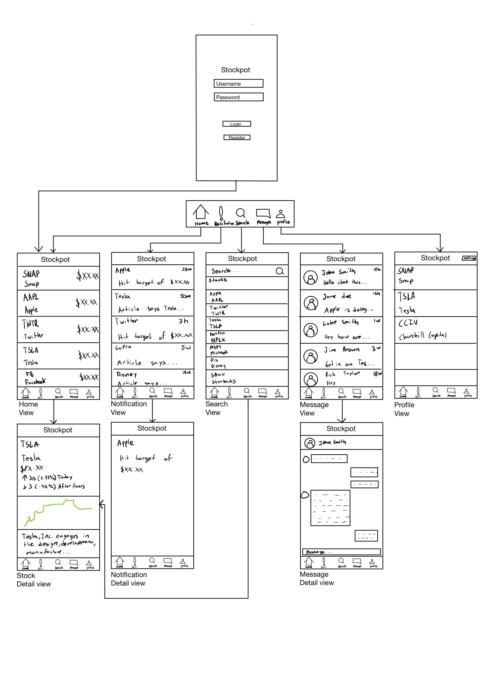
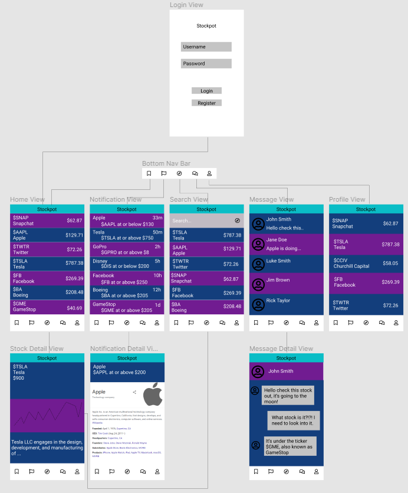
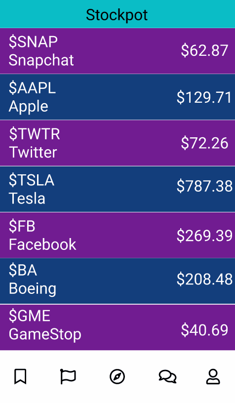

Original App Design Project - README
===

# Stockpot

## Table of Contents
1. [Overview](#Overview)
1. [Product Spec](#Product-Spec)
1. [Wireframes](#Wireframes)
2. [Schema](#Schema)

## Overview
### Description
Stockpot is an Android application developed to allow users to follow stocks, retrieve additional information on stocks, and interact with other users in a social media platform. Users can also create posts of their analysis and their predictions.

### App Evaluation
- **Category:** Finance
- **Mobile:** The application is primarly developed for mobile, however it would be viable for future implementation on desktop or web-based applications.
- **Story:** Analyzes user selected stocks and displays data about them, and notifies them when stocks hit a threshold. 
- **Market:** Any individual over 18 can use this application to augment their trading experience. 
- **Habit:** This mobile app can be used as often as the user would like depending on how interested the user is in stock trading.
- **Scope:** The audience of this app is targeted towards those who are interested in trading equities or learning more about trading in general.

## Product Spec

### 1. User Stories (Required and Optional)

**Required Must-have Stories**

* Create an account, log in, log out
* Search for stock and have a list matching search query pop up
* Detail view for the individual stock
* Allow user to create a watchlist for easy access to favorited stocks
* Create posts including analysis and predictions

**Optional Nice-to-have Stories**

* News for relevant stocks (from Bloomberg API)
* Social media aspect
    * Messages

### 2. Screen Archetypes

* Login
* Register - User signs up or logs into their account
   * Upon download/reopening of the application, the user is prompted to log in to gain access to their profile information
* Home Feed
   * User can view the most recent posts of other users (or their own posts) in order of latest posts appearing first
* Search 
    * Allows user to search for stocks 
* Detail 
    * View in-depth information on the selected stocks from the ListView (Search Screen or Profile Screen)
* Profile
    * User can view their watchlist and other related information
* Compose
    * User can create a new post that will show up on the Home Feed  

### 3. Navigation

**Tab Navigation** (Tab to Screen)

* Home Feed
* Compose
* Search
* Profile / Watchlist

**Flow Navigation** (Screen to Screen)

* Forced Log-in -> Account creation if no log in is available
* Search -> Toggle Search -> Find the stock and show its data
* Profile -> Detail

## Wireframes
[Add picture of your hand sketched wireframes in this section]


### [BONUS] Digital Wireframes & Mockups


### [BONUS] Interactive Prototype


## Schema 
### Models
#### User

| Property      | Type     | Description |
   | ------------- | -------- | ------------|
   | objectId      | String   | unique id for the user post (default field) |
   | profilePicture         | File     | image that user posts |
   | username      | String | username for the user |
   | password      | String   | password for the user   |
   | stocks       | Array   | array of stocks |
   | notifications | Array | array of notifications | 
   
#### Stock

| Property      | Type     | Description |
   | ------------- | -------- | ------------|
   | name      | String   | name of the stock |
   | tickerSym         | String     | abbreviation representing the stock |
   | description      | String | description of the company/equity |
   | wkLow      | String   | 52 week low   |
   | wkHigh       | String   | 52 week high |
   | open | String | price at open during the day | 
   | high         | String     | highest price during the time period |
   | low      | String   | lowest price during the time period   |
   | price       | String   | current price |
   | volume | String | number of buys and sells during the given time period | 
   | change      | String   | the price difference of the day prior and the current day in decimal format   |
   | changePercent       | String   | the price difference of the day prior and the current day in percentage format |
   
   
#### Post

| Property      | Type     | Description |
   | ------------- | -------- | ------------|
   | user      | String   | unique id for the user post (default field) |
   | description         | File     | brief overview describing the Post created by the user |
   | image      | String | image for the post |
   | created_at      | String   | date and time when the post was created   |
   
### Networking
#### List of network requests by screen
   - Login/Register Screen
      - (Read/GET) Query logged in user object
         ```swift
            ParseUser.logInInBackground("<userName>", "<password>", (user, e) -> {
             if (user != null) {
                 // Hooray! The user is logged in.
             } else {
                 // Login failed. Look at the ParseException to see what happened.
                 Toast.makeText(this, e.getMessage(), Toast.LENGTH_SHORT).show();
             }
          });
         ```
      - (Create/POST) Create a new user object
         ```swift
            ParseUser user = new ParseUser();
            user.setUsername("my name");
            user.setPassword("my pass");
            user.setEmail("email@example.com");
            user.signUpInBackground(e -> {
             if (e == null) {
                 // Hooray! Let them use the app now.
             } else {
                 // Sign up didn't succeed. Look at the ParseException
                 // to figure out what went wrong
                 Toast.makeText(this, e.getMessage(), Toast.LENGTH_SHORT).show();
             }
           });
          ```
   - Home Feed Screen
      - (Read/GET) Query top trending stocks
   - Search Screen
      - (Read/GET) Query stock object with name that has been searched
         ```swift
            AsyncHttpClient client  = new AsyncHttpClient();
            client.get(URL.format(OVERVIEW, symbol), new JsonHttpResponseHandler() {
               @Override
               public void onSuccess(int i, Headers headers, JSON json) {
                   Log.d(TAG, "onSuccess");
                   JSONObject jsonObject = json.jsonObject;
                   try {
                       stocks.addAll(Stock.fromJsonObject(jsonObject));
                       stockAdapter.notifyDataSetChanged();
                   } catch (JSONException e) {
                       Log.e(TAG, "Hit json exception", e);
                   }
               }

               @Override
               public void onFailure(int i, Headers headers, String s, Throwable throwable) {
                   Log.d(TAG, "onFailure");
               }
           });
         ```
   - Detail Screen
      - (Read/GET) Query stock object that has been selected
         ```swift
            AsyncHttpClient client  = new AsyncHttpClient();
            client.get(URL.format(OVERVIEW, symbol), new JsonHttpResponseHandler() {
               @Override
               public void onSuccess(int i, Headers headers, JSON json) {
                   Log.d(TAG, "onSuccess");
                   JSONObject jsonObject = json.jsonObject;
                   try {
                       Stock stock = Stock.fromJsonObject(jsonObject);
                   } catch (JSONException e) {
                       Log.e(TAG, "Hit json exception", e);
                   }
               }

               @Override
               public void onFailure(int i, Headers headers, String s, Throwable throwable) {
                   Log.d(TAG, "onFailure");
               }
           });
         ```
   - Profile Screen
      - (Read/GET) Query stocks the user is following
          ```swift
            ParseQuery<Post> query = ParseQuery.getQuery(User.class);
            query.include(Post.KEY_USER);
            query.whereEqualTo(Post.KEY_USER, ParseUser.getCurrentUser());
            query.addDescendingOrder(User.STOCKS_KEY);
            query.findInBackground(new FindCallback<Post>() {
               @Override
               public void done(List<Post> posts, ParseException e) {
                   if (e != null) {
                       Log.e(TAG, "Issue with getting posts", e);
                       return;
                   }
                   for (Post post: posts) {
                       Log.i(TAG, "Post: " + post.getDescription() + ", username: " + post.getUser().getUsername());
                   }
                   allUserStocks.addAll(stocks);
                   adapter.notifyDataSetChanged();
               }
           });
          ```
   - Notification Screen
      - (Read/GET) Query notifications from user object
         ```swift
            ParseQuery<Post> query = ParseQuery.getQuery(User.class);
            query.include(Post.KEY_USER);
            query.whereEqualTo(Post.KEY_USER, ParseUser.getCurrentUser());
            query.addDescendingOrder(User.NOTIFICATIONS_KEY);
            query.findInBackground(new FindCallback<Post>() {
               @Override
               public void done(List<Post> posts, ParseException e) {
                   if (e != null) {
                       Log.e(TAG, "Issue with getting posts", e);
                       return;
                   }
                   for (Post post: posts) {
                       Log.i(TAG, "Post: " + post.getDescription() + ", username: " + post.getUser().getUsername());
                   }
                   allUserNotifications.addAll(notifications);
                   adapter.notifyDataSetChanged();
               }
           });
          ```
